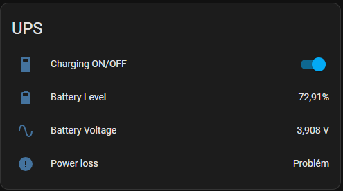

# Suptronics UPS X120x Home Assistant Integration

Integration for Suptronics UPS X120x boards (models X1200, X1201, and X1202).  
Allows monitoring and management of your Suptronics UPS directly in Home Assistant.



## Features
- Monitor UPS battery level as a percentage
- Monitor UPS battery voltage
- Power-loss detection via binary sensor
- Switch for turning charging on/off
- Automatic updates of sensor values

## Requirements
- **I2C interface enabled** on your device (Raspberry Pi or similar).  
- Python packages `smbus2` and `gpiod` (handled automatically by Home Assistant if requirements are specified in `manifest.json`).

## Installation

### 1) Manual Copy
1. Download (or clone) this repository.
2. Copy the folder `suptronics_ups_x120x` into your Home Assistant `custom_components` folder.
   - Your final path might look like:  
     `config/custom_components/suptronics_ups_x120x/`

### 2) Enable I2C
I2C is required for reading battery levels from the Suptronics board.

- **Home Assistant OS (HassOS)**  
  Follow the [official instructions](https://www.home-assistant.io/common-tasks/os/#enable-i2c) or use the [HassOS I2C Configurator addon](https://community.home-assistant.io/t/add-on-hassos-i2c-configurator/264167).  

- **Home Assistant Core / Raspberry Pi OS**  
  1. Enable I2C interface:  
     ```bash
     sudo raspi-config
     ```
     Choose `Interfacing options -> I2C`, select `<Yes>`, then finish and reboot.
  2. Install additional packages (e.g., `i2c-tools`, `libi2c-dev`, etc.) if needed.  
     ```bash
     sudo apt-get install build-essential libi2c-dev i2c-tools python-dev libffi-dev
     ```
     Add your `homeassistant` user to the i2c group:
     ```bash
     sudo addgroup homeassistant i2c
     sudo reboot
     ```
  3. (Optional) Check the I2C address using:
     ```bash
     /usr/sbin/i2cdetect -y 1
     ```

### 3) Add Integration in Home Assistant
1. **Restart Home Assistant** after placing the files in `custom_components`.
2. Go to **Settings > Devices & Services** in Home Assistant.
3. Click **“Add Integration”** and search for **“Suptronics X120x”**.  
4. Add the integration. No extra input is required during setup. The integration will create sensors for battery level and voltage automatically.

> **Important:** If you have used a previous version that was configured in `configuration.yaml`, you must remove those old entries before using the new version. This integration is now fully managed from the UI and does not require YAML configuration.

### 4) Optional: GPIO-based Sensors/Switches
If you want to manage additional features (like detecting power loss or controlling charging) at the GPIO level, you can rely on the built-in `binary_sensor` and `switch` platforms within this integration. After enabling the config flow, you will see:
- A binary sensor named “UPS Power” for detecting power loss.
- A switch named “UPS charging ON/OFF” to start/stop charging.

#### Changing Device Class or Invert Logic
If you need to adjust the power sensor device class or invert logic, go to **Settings > Devices & Services > Integrations**.  
Find **Suptronics X120x**, click **“Configure”**, and modify options as needed.

### Usage
- **Battery sensors**:  
  - `sensor.ups_battery_level` (percentage)  
  - `sensor.ups_battery_voltage` (volts)

- **Binary Sensor**:  
  - `binary_sensor.ups_power`  
  Shows `on` if power is lost (depending on invert logic settings).

- **Switch**:  
  - `switch.ups_charging_on_off`  
  Allows you to turn charging on or off.

### Upgrading from a previous version
- Remove or comment out any old `suptronics_ups_x120x:` entries from your `configuration.yaml`.
- Remove old references to manual GPIO config if you previously used `rpi_gpio` or custom YAML for controlling the UPS.
- Copy the new version of the integration into `custom_components`.
- Restart Home Assistant and add the integration from the UI if needed. The system should pick up your existing configuration (if properly migrated).

### Debugging
If you have issues, enable debug logging. Add the following to `configuration.yaml`:
```yaml
logger:
  default: info
  logs:
    custom_components.suptronics_ups_x120x: debug
